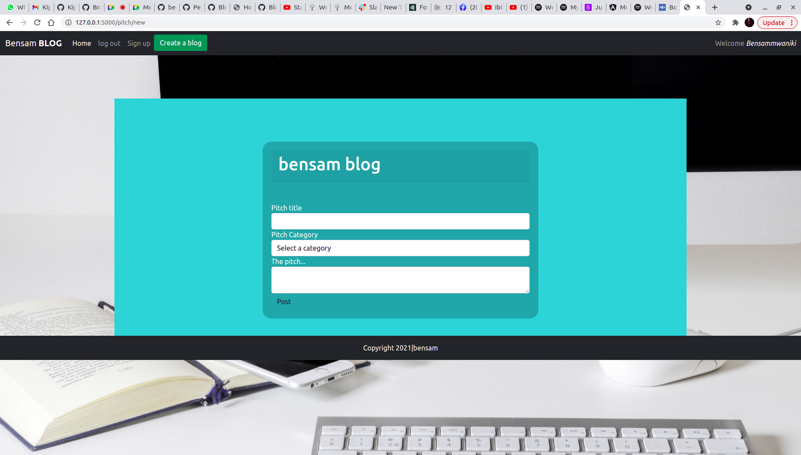

# Bensam blog
### Here is an overview of Impress me App, September 2021

#### By **Bensam mwaniki**
## Description
This is an application the registers users and gives them an opportunity to impress their readers. It also keeps track of user data like how many comments the user has added.it generates radom qoutes.

## BEHAVIOUR DRIVEN DEVELOPMENT
| GENERAL BEHAVIOUR | INPUT | OUTPUT|
|:------------------|:--------|:-----------|
|login| username and password|user is logged in|
|register| users name ,email and password|user is registered|
|post a pitch| usercan categorize his or her comments| posts user pitch
|comment| user enters comment to a certain pitch|comment is added to the pitch|
|   |    |
## Setup/Installation Requirements
* clone the following repo https://github.com/bensammwaniki/blog
* use your desired folder on your machine and clone
the repo there
* Install all required prerequisities.
* In your terminal run the following commands
* $ chmod a+x start.sh

## Known Bugs
no know bugs
If you experience any you can reach via email bensammwaniki@gmail.com
## Technologies Used
1.Python 

2.Flask

## Support and contact details
Incase of any queries you can reach me through email bensammwaniki@gmail.com

### License
This Project comes wit MIT License. .

MIT License

Copyright (c) 2021 By Bensam Mwaniki

Permission is hereby granted, free of charge, to any person obtaining a copy
of this software and associated documentation files (the "Software"), to deal
in the Software without restriction, including without limitation the rights
to use, copy, modify, merge, publish, distribute, sublicense, and/or sell
copies of the Software, and to permit persons to whom the Software is
furnished to do so, subject to the following conditions:

The above copyright notice and this permission notice shall be included in all
copies or substantial portions of the Software.

THE SOFTWARE IS PROVIDED "AS IS", WITHOUT WARRANTY OF ANY KIND, EXPRESS OR
IMPLIED, INCLUDING BUT NOT LIMITED TO THE WARRANTIES OF MERCHANTABILITY,
FITNESS FOR A PARTICULAR PURPOSE AND NONINFRINGEMENT. IN NO EVENT SHALL THE
AUTHORS OR COPYRIGHT HOLDERS BE LIABLE FOR ANY CLAIM, DAMAGES OR OTHER
LIABILITY, WHETHER IN AN ACTION OF CONTRACT, TORT OR OTHERWISE, ARISING FROM,
OUT OF OR IN CONNECTION WITH THE SOFTWARE OR THE USE OR OTHER DEALINGS IN THE
SOFTWARE.